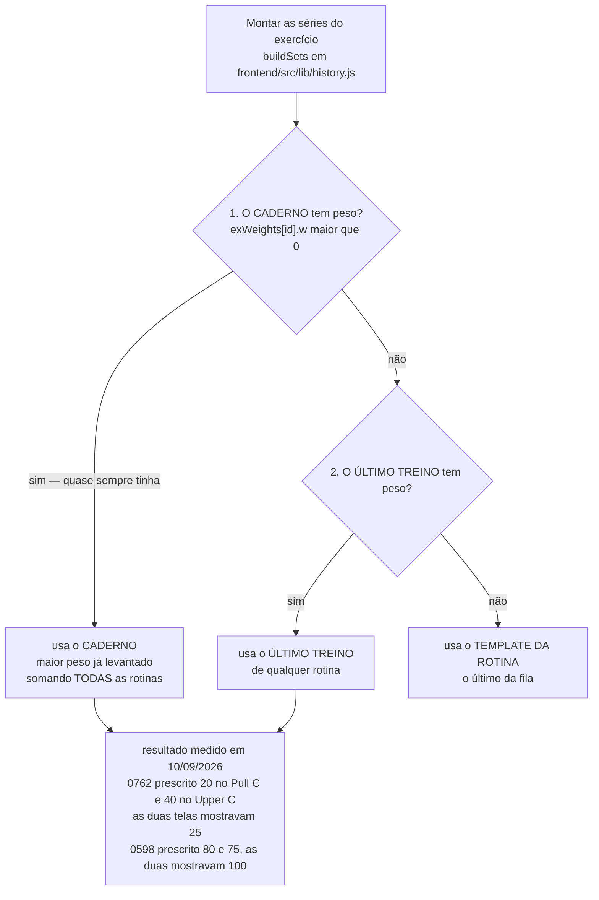
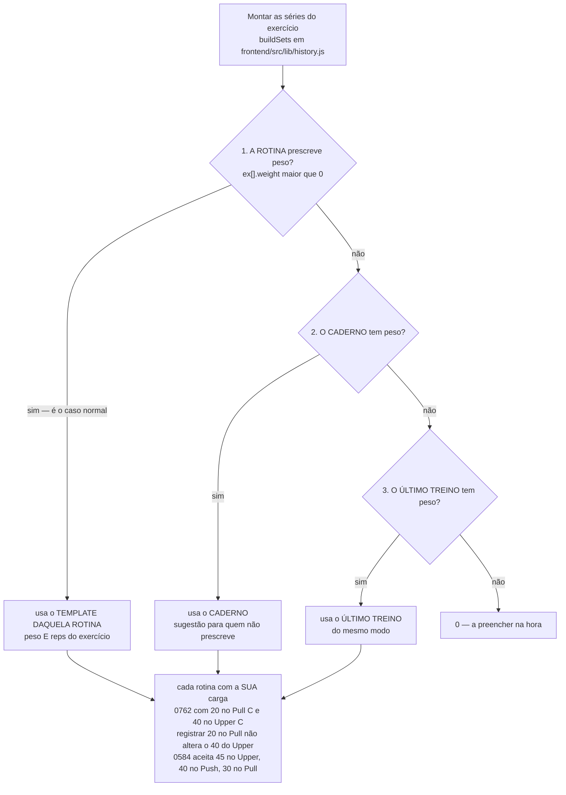
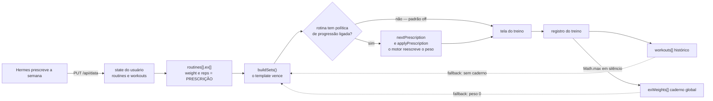
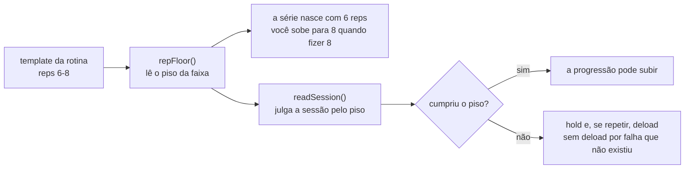

# Solução da BACKLOG-05 — peso e reps por rotina (diagramas)

> Acompanha a **BACKLOG-05** (diagnóstico) e a **BACKLOG-06** (implementação), encerradas em 10/09/2026 e
> registradas na seção **Concluídos** de `docs/backlog.md`.
>
> - **Implementação:** commit `49fa3c1` (6 arquivos, +124/−19), publicado no container do Pi.
> - **Spec detalhada:** `docs/specs/spec_peso_e_reps_por_rotina.md` (v3, 630 linhas, 2 revisões por subagente).
> - **Verificação na tela:** `~/.hermes/workout/reports/verificacao_p1_20260910.txt` — 35/35 combinações
>   rotina×exercício mostram o peso do template.
> - **Página com os mesmos diagramas renderizados** (fora do repo, leitura local):
>   `http://127.0.0.1:8765/backlog05_solucao_mermaid.html`, servida de `C:\Users\emerson`.
>
> Os quatro diagramas abaixo foram validados pelo parser do Mermaid **e** renderizados (SVG gerado, com
> nós e arestas conferidos) antes de entrarem aqui.

## 1. Antes — o caderno de pesos mandava

A ordem consultada em `buildSets` era *caderno global → último treino de qualquer rotina → template da
rotina*: o peso prescrito era o **último** da fila e quase sempre perdia. Como o caderno só sobe
(`Math.max`) e é por exercício, ele achatava todas as rotinas no maior peso já levantado.

## 2. Depois — a rotina é a prescrição

A ordem inverteu: **template da rotina → caderno → último treino do mesmo modo → 0**. O caderno virou
sugestão apenas para quem não prescreve (peso 0), e as reps do template também passam a vencer.

Consequências registradas na BACKLOG-06: a proibição de alvos divergentes entre rotinas (que existia na
`spec_micro_via_app_v5.md` só por causa deste bug) caiu, e ela já está em uso no mesociclo atual
(`0598` 80 no Legs 1 / 75 no Legs 2, `0762` 20 no Pull / 25 no Upper, `0326` 8 / 9, desenv 114 no Push /
110 no Upper).

## 3. A cadeia completa no app — e quem escreve cada valor

O template vence **dentro** do `buildSets`; o motor de progressão só opina **depois**, e só quando uma
política está ligada de propósito na rotina ou no exercício. Com o padrão novo (`off`), rotina criada,
importada ou escrita pelo Hermes não é reescrita pelo motor.

## 4. Faixa de reps "6-8" — o piso, nos dois lugares

O mesmo número precisa valer para o que a tela pré-preenche **e** para o que o motor considera sessão
cumprida. Antes, `readSession` comparava `"6-8" > 0` (falso em JS), ou seja, toda sessão de uma rotina em
faixa contava como falha e levava deload de 10 % sobre a carga prescrita.

## Regras que ficaram valendo

- **Um dono por número.** Ou o Hermes prescreve a semana no template (e a política fica `off`), ou o app
  progride sozinho pela política — nunca os dois no mesmo exercício, senão o motor sobrescreve a
  prescrição sem avisar.
- **Portão antes de aplicar.** O lado Hermes passou a calcular o que a tela vai mostrar e a comparar com
  a intenção antes de gravar (`~/.hermes/workout/scripts/verificar_prescricao.py`). Foi a ausência dessa
  checagem que deixou o bug passar por semanas.
- **O que o caderno ainda faz.** Alimenta o **Best: N kg** da tela, o fallback de exercício com peso 0 e
  a ordem de sugestão. Continua sendo gravado — só deixou de mandar.
- **Mecânica documentada dos dois lados.** `~/.hermes/workout/MECANICA_PESOS.md` (Hermes) é a versão
  vigente; este documento e a BACKLOG-05 são o registro de como o desalinhamento aconteceu.

## Onde cada peça vive

| Peça | Onde | Papel depois da mudança |
|---|---|---|
| Prescrição | `routines[].ex[].weight` / `.reps` | é o que a tela mostra (RF-1/RF-3) |
| Caderno | `S.exWeights` (global, só sobe) | fallback de peso 0 + `Best:` da tela |
| Histórico | `workouts[].entries[].sets[]` | fallback e base de cálculo da progressão |
| Motor | `frontend/src/lib/progression.js` | só opina com política explícita |
| Piso da faixa | `repFloor()` em `frontend/src/lib/history.js` | usado por `buildSets` e por `readSession` |
| Prescrição externa | `PUT /api/data` (Hermes) | grava o template; a API de rotinas é a BACKLOG-07 |
